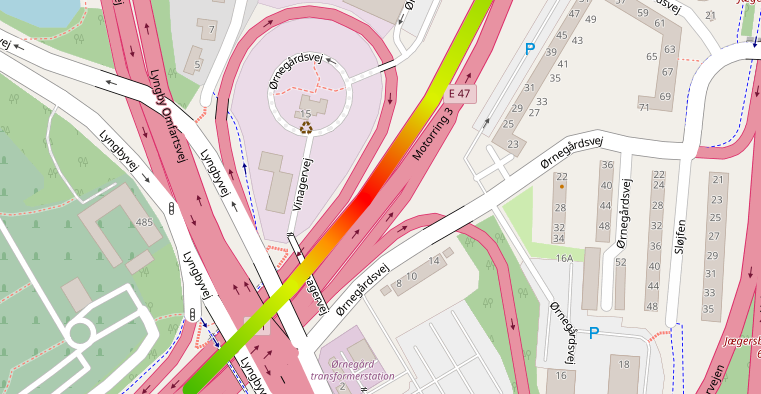

    <h1>react-leaflet-hotline</h2>
    <h3>Create colored gradient Polylines in react-leaflet</h3>
     
    

        
    

 

  <ul style='margin-top: 10px'>
    <li><b>Typescript</b> support</li>
    <li>Both <b>Hook</b> and standalone <b>Component</b> available</li>
    <li>Highly customizable</li>
    <li>Support all leaflet events (click, mouseover, mouseout, ...)</li>
    <li>Lightweight: <b> <100 kB </b> </li>
  </ul>

  

    <a href="https://react-leaflet-hotline.netlify.app" target="_blank">
    Live playground with examples here 🎨
    </a>
  

